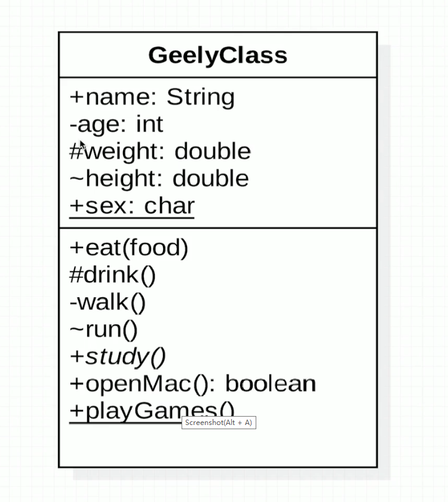
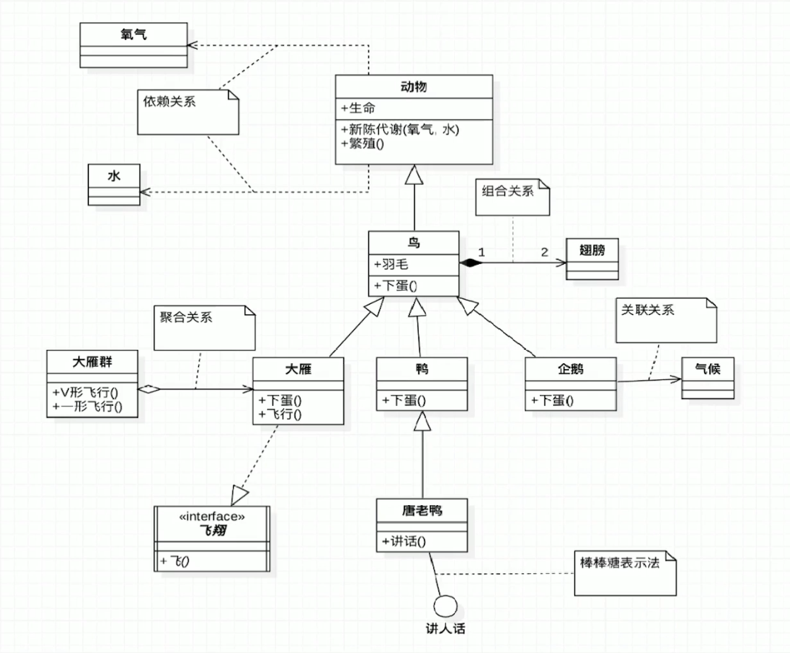

# UML类图

* Class Diagram：用于表示类、接口、实例等之间相互的静态关系
* 类图中并不只有类

## 记忆技巧

* UML箭头方向：从子类指向父类
* 实线——继承，is a关系。虚线——实现，无实体。空心三角箭头——继承或实现。
* 空心菱形——聚合，实心菱形——组合。

聚合：代表空器皿里可以放很多相同的东西，聚在一起（箭头方向所指的类），整体和局部的关系，两者有相同的生命周期，是has a关系

组合：代表满器皿里已经有实体结构的存在，生死与共，整体和局部的关系，和聚合关系相比，关系更加强烈，两者有相同的生命周期，contains a关系

图中 *+study()* 表明这是一个抽象方法，那么GeelyClass也为抽象类应斜体表示。

