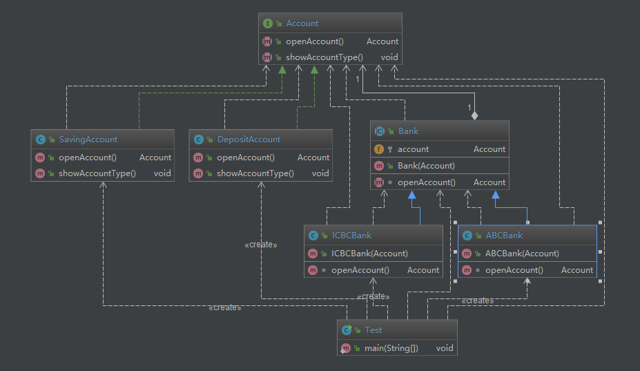

# 桥接模式

## 桥接-定义与类型

* 定义：将抽象部分与它的具体实现部分分离，使它们都可以独立地变化
* 通过组合的方式建立两个类之间联系，而不是继承
* 类型：结构型

## 桥接-适用场景

* 抽象和具体之间增加更多的灵活性
* 一个类存在两个（或多个）独立变化的维度，且这两个（或多个）维度都需要独立进行扩展
* 不希望使用继承，或因为多层继承导致系统类的个数剧增

## 桥接-优点

* 分离抽象部分及其具体实现部分
* 提高了系统的可扩展性

* 符合开闭原则
* 符合合成复用原则

## 桥接-缺点

* 增加了系统的理解与设计难度
* 需要正确地识别出系统中两个独立变化的维度

## 桥接-相关设计模式

* 桥接模式和组合模式
* 桥接模式和适配器模式

